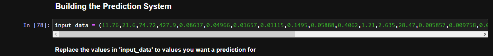
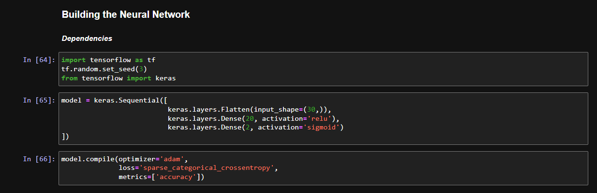
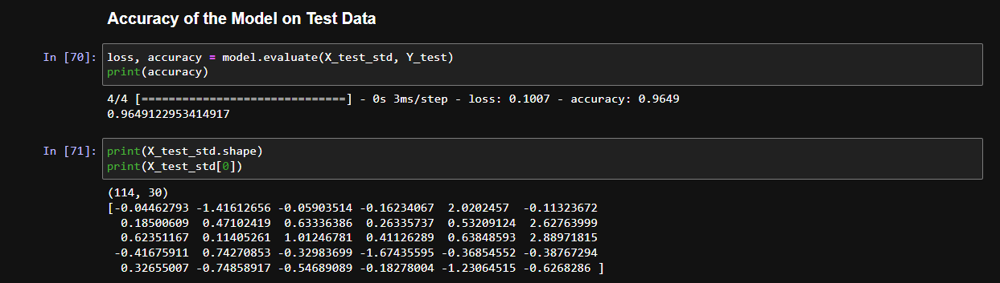
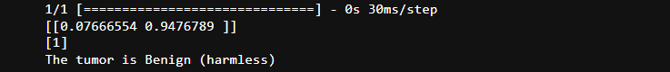

# Breast Cancer Detection with Neural Network

This repository contains a simple neural network implementation for detecting breast cancer using the Breast Cancer dataset from SKLearn. The goal of this project is to demonstrate the process of data preprocessing, building a neural network model, training, evaluating, and making predictions on new data points.

## Dependencies

Before running the code, make sure you have the following dependencies installed:

- numpy
- pandas
- matplotlib
- scikit-learn
- tensorflow

You can install these dependencies using the following command:

```bash
pip install numpy pandas matplotlib scikit-learn tensorflow
```

## Project Structure

- `BreastCancerDetection.ipynb`: A Jupyter Notebook containing the complete code for the project, including data preprocessing, model building, training, and prediction.
- `breast-cancer-detection.pdf`: A pdf file showing an example run of the model.
- `data.csv`: The Breast Cancer dataset in a *.csv* format.
- `resources`: It has images and files for this repo.
- `README.md`: This file, providing an overview of the project, instructions, and explanations.

## How to Use

1. Clone the repository to your local machine:

```bash
git clone https://github.com/arindal1/breast-cancer-detection.git
```

2. Navigate to the repository folder:

```bash
cd breast-cancer-detection
```

3. Open and run the `breast_cancer_detection.ipynb` Jupyter Notebook using Jupyter or any other compatible environment. The notebook contains step-by-step explanations and code for data preprocessing, model building, training, and making predictions.

### OR (alternatively)

4. Visit the Google Collab link below (External Links).

## Dataset

The Breast Cancer dataset used in this project is from SKLearn's dataset collection. The dataset contains features such as mean radius, mean texture, mean perimeter, and others, which are used to predict whether a tumor is benign (not harmful) or malignant (harmful).

# Breakdown of 'BreastCancerDetection.ipynb'

It is a step-by-step implementation of a simple neural network for breast cancer detection using the Breast Cancer dataset from SKLearn. Here's a breakdown of the code and its functionality:

1. **Data Collection and Processing**:
   - The Breast Cancer dataset is loaded using SKLearn.
   - The dataset is converted into a Pandas DataFrame.
   - A 'label' column is added to the DataFrame, representing the target (0 for malignant, 1 for benign).
   - Basic data exploration, such as checking for missing values, summarizing statistics, and analyzing class distribution, is performed.

2. **Separating Features and Target**:
   - Features (X) are extracted by dropping the 'label' column from the DataFrame.
   - The target values (Y) are extracted into a separate variable.

3. **Data Splitting and Standardization**:
   - The data is split into training and testing sets using `train_test_split`.
   - The features of both training and testing data are standardized using `StandardScaler`.

4. **Building the Neural Network**:
   - A simple neural network model is defined using Keras.
   - The model consists of a flattened input layer, a hidden layer with ReLU activation, and an output layer with sigmoid activation.
   - The model is compiled with the Adam optimizer and sparse categorical cross-entropy loss function.

5. **Training the Neural Network**:
   - The model is trained on the standardized training data using the `fit` function.
   - Training history (accuracy and loss) is stored in the `history` object.

6. **Visualizing Accuracy and Loss**:
   - The accuracy and loss curves during training and validation are plotted using Matplotlib.

7. **Evaluating the Model**:
   - The trained model is evaluated on the standardized testing data, and accuracy is printed.

8. **Predicting with the Model**:
   - Predictions are made using the trained model on new input data.
   - The example input data is provided in the code.
   - The input data is standardized and fed into the model.
   - The model's prediction probabilities and labels are displayed.
   - The `argmax` function is used to determine the predicted label.

9. **Building the Prediction System**:
   - A specific example input data point is provided.
   - The input data is standardized and passed through the trained model.
   - The predicted label is determined and displayed based on the highest predicted probability.



This code provides a thorough walkthrough of building a simple neural network for breast cancer detection using the given dataset and making predictions on new data points. However, keep in mind that for a real-world application, additional considerations such as hyperparameter tuning, cross-validation, and more complex model architectures might be necessary for optimal performance.

## Neural Network Architecture



The neural network model consists of:
- A flattened input layer with 30 input nodes, representing the features.
- A hidden layer with 20 nodes and ReLU activation function.
- An output layer with 2 nodes and sigmoid activation function, representing the two classes (benign and malignant).

The model is compiled using the Adam optimizer and sparse categorical cross-entropy loss function.

Let's break down each layer in detail:

1. **Input Layer**:
   - The input layer is responsible for receiving the feature data of each data point.
   - In this project, the input layer has 30 nodes, which corresponds to the number of features in the Breast Cancer dataset. Each node represents a different feature, such as mean radius, mean texture, mean perimeter, and so on.
   - The input data is flattened before being fed into the neural network. Flattening means converting the 2D feature array into a 1D array, making it suitable for the input layer.

2. **Hidden Layer**:
   - The hidden layer is where the neural network starts to learn patterns and relationships from the input data.
   - In this project, the hidden layer has 20 nodes.
   - Each node in the hidden layer performs a weighted sum of the outputs from the previous layer (input layer) and applies an activation function to introduce non-linearity. The activation function used in this layer is the Rectified Linear Unit (ReLU).
   - ReLU activation function: For each node's output, if the weighted sum is positive, the output is equal to the weighted sum; if the weighted sum is negative, the output is zero. Mathematically, it can be expressed as `output = max(0, weighted_sum)`.

3. **Output Layer**:
   - The output layer produces the final results of the neural network's predictions.
   - In this project, the output layer has 2 nodes, corresponding to the two classes: benign (not harmful) and malignant (harmful).
   - The activation function used in the output layer is the sigmoid function. The sigmoid function squashes the output values between 0 and 1, which can be interpreted as probabilities. Each node's output represents the probability that the input data point belongs to one of the classes.

The architecture can be visually represented as follows:

```
Input Layer (30 nodes)
          |
          |  (Weights and Bias)
          v
Hidden Layer (20 nodes, ReLU activation)
          |
          |  (Weights and Bias)
          v
Output Layer (2 nodes, Sigmoid activation)
```

The neural network is designed to learn the weights and biases that optimize the performance on the given task. During training, the weights and biases are updated through backpropagation and gradient descent, minimizing the loss between predicted and actual labels. The choice of activation functions, number of hidden layers, and number of nodes in each layer can have a significant impact on the network's ability to learn and generalize patterns in the data.

## Results



After training the model, accuracy and loss curves are visualized using Matplotlib. The model's accuracy on the test data is also printed.

## Making Predictions



The model is used to make predictions on new data points. An example input data point is provided in the code, which is standardized and passed through the trained model. The predicted label (benign or malignant) is determined and displayed based on the highest predicted probability.

## Note

This project serves as a simple demonstration of building and training a neural network for breast cancer detection. For real-world applications, further optimizations, hyperparameter tuning, and more complex models might be necessary for accurate predictions.

## Contribution

Contributions are welcome! If you find any issues or want to enhance the project, feel free to submit a pull request.

## Contact

If you have any questions or suggestions, feel free to contact me on [Github](https://github.com/arindal1), [LinkedIn](https://www.linkedin.com/in/arindalchar/).

## External Links

- [Google Collab](https://colab.research.google.com/drive/1GvJ8vgeFi7nbHetby36z5S_LkDNgIfBD?usp=sharing)
- [Breast Cancer Dataset](https://scikit-learn.org/stable/datasets/toy_dataset.html#breast-cancer-dataset)
- [TensorFlow Documentation](https://www.tensorflow.org/)

### Happy learning! 🚀
